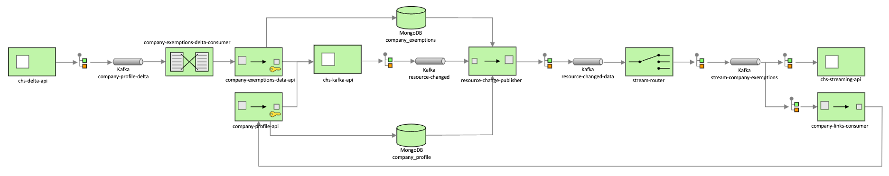

# company-exemptions-delta-consumer
Transforms company exemptions deltas into an entity sent to company-exemptions-data-api

``company-exemptions-delta-consumer`` reads messages from the company-exemptions-delta-consumer topic, determines if the message from the queue is to either:
* Delete a company exemption
* Create or update a company exemption

## System requirements

* [Git](https://git-scm.com/downloads)
* [Java](http://www.oracle.com/technetwork/java/javase/downloads)
* [Maven](https://maven.apache.org/download.cgi)

## Getting started

### Building and running locally using docker

1. Clone [Docker CHS Development](https://github.com/companieshouse/docker-chs-development) and follow the steps in the
   README.
2. Enable the required services by running the following command in the `docker-chs-development` directory

```bash
  chs-dev services enable \
  chs-delta-api \
  company-exemptions-delta-consumer \
  company-exemptions-data-api \
  company-profile-api \
  chs-kafka-api mongo \
  company-links-consumer \
  chs-streaming-api
```
3. Boot up the services' containers on docker using `chs-dev up`.



### Testing locally

To test `company-exemptions-delta-consumer` you will need the following software:
* Postman - API development tool
* Studio 3T - MongoDB IDE

#### Updating / inserting delta (POST)

http://api.chs.local:4001/delta/exemption
```json
{
    "company_number": "IP031918",
    "exemption": {
        "psc_exempt_as_trading_on_regulated_market": {
            "description": "Non-UK EEA state market",
            "items": [
                {
                    "exempt_from": "20181219",
                    "exempt_to": "20211219"
                }
            ]
        },
        "psc_exempt_as_shares_admitted_on_market": {
            "description": "Schedule 1 Register market",
            "items": [
                {
                    "exempt_from": "20171219",
                    "exempt_to": ""
                }
            ]
        },
        "psc_exempt_as_trading_on_uk_regulated_market": {
            "description": "UK EEA state market",
            "items": [
                {
                    "exempt_from": "20210110",
                    "exempt_to": "20210212"
                }
            ]
        },
        "psc_exempt_as_trading_on_eu_regulated_market": {
            "description": "EU state market",
            "items": [
                {
                    "exempt_from": "20211219",
                    "exempt_to": ""
                }
            ]
        }
    },
    "delta_at": "20240102142043360560"
}

```
#### Delete delta (POST)

http://api.chs.local:4001/delta/exemption/delete
```json
{
    "company_number": "IP031918",
    "action": "DELETE",
    "delta_at": "20241231142043360560"
}
```

### Building the docker image with local changes, requires access to AWS ECR

```bash
  mvn package -Dskip.unit.tests=true -Dskip.integration.tests=true jib:dockerBuild
```

### Environment variables

| Variable                              | Description                                                                                             | Example (from CIDEV      )                        |
|---------------------------------------|---------------------------------------------------------------------------------------------------------|---------------------------------------------------|
| `SERVER_PORT`                         | The port at which the service is hosted in ECS                                                          | 18614                                             |
| `BOOTSTRAP_SERVER_URL`                | The URL to the kafka broker                                                                             | kafka3-common-kafka-1.aws.chdev.org:9092          |
| `TOPIC`                               | The topic to read messages from                                                                         | cidev-company-exemptions-delta                    |
| `GROUP_ID`                            | The group ID of the main consume                                                                        | company-exemptions-delta-consumer                 |
| `CONCURRENT_LISTENER_INSTANCES`       | The number of consumers that should participate in the consumer group                                   | 1                                                 |
| `BACKOFF_DELAY`                       | The incremental time delay between message retries                                                      | 5                                                 |
| `MAX_ATTEMPTS            `            | The number of times a message will be retried before being moved to the error topic                     | 1000                                              |
| `INVALID_MESSAGE_TOPIC`               | The topic to which message are sent if any unchecked exception other than  RetryableException is thrown | tbirds1-company-exemptions-delta-consumer-invalid |
| `CHS_API_KEY`                         | The client ID of an API key, with internal app privileges                                               | 63db7d49-de65-44ca-8959-217a99e890fb              |
| `PAYMENTS_URL`                        | Payments API URL                                                                                        | https://api-payments.cidev.aws.chdev.org          |
| `API_URL`                             | URL to CHS API                                                                                          | http://api.chs.local:4001                         |
| `CHS_KAFKA_API_URL`                   | The URL which the chs-kafka-api is hosted on                                                            | 63db7d49-de65-44ca-8959-217a99e890fb              |

## Other useful information

### Error handling

The table below describes the topic a Kafka message is published to when an API error response is received, given the
number of attempts to process that message. The number of attempts is incremented when processed from the main or
retry topic. Any runtime exceptions thrown during the processing of a message are handled by publishing the message
immediately to the <br>`company-exemptions-delta-company-exemptions-delta-consumer-invalid` topic and are not retried.

| API Response | Attempt          | Topic published to                                                 |
|--------------|------------------|--------------------------------------------------------------------|
| 2xx          | any              | _does not republish_                                               |
| 400 or 409   | any              | company-exemptions-delta-company-exemptions-delta-consumer-invalid |
| 4xx or 5xx   | < max_attempts   | company-exemptions-delta-company-exemptions-delta-consumer-retry   |
| 4xx or 5xx   | \>= max_attempts | company-exemptions-delta-company-exemptions-delta-consumer-error   |